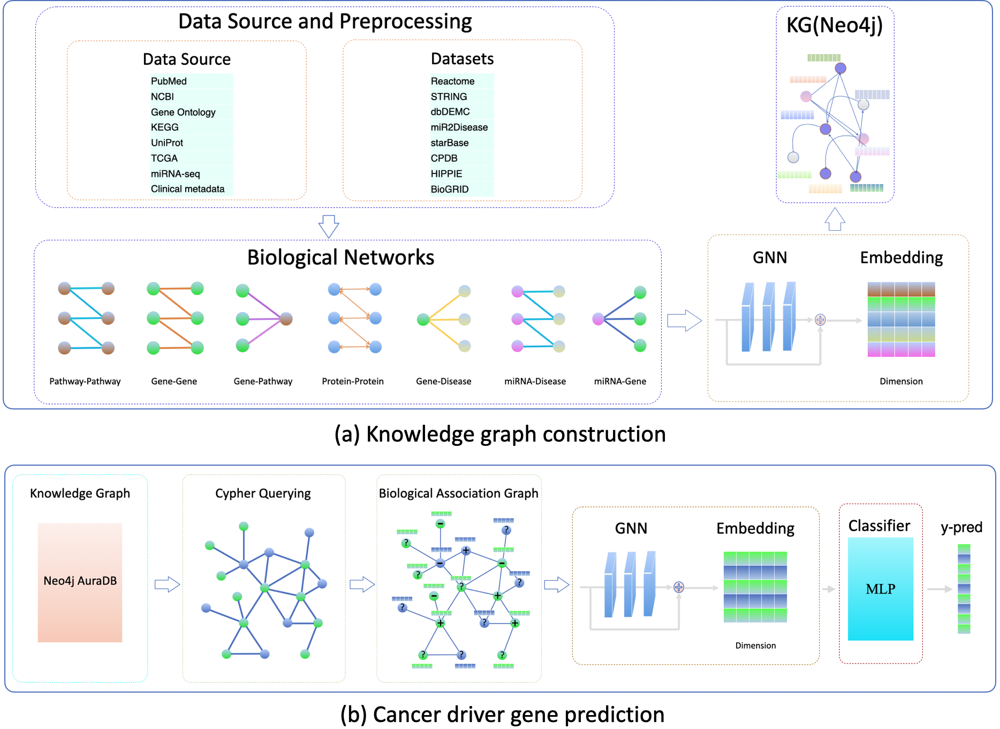

# EmbedKG: Graph Neural Network with Knowledge Graph Embeddings for Cancer Driver and miRNA Regulator Discovery

This repository provides the implementation and source code for our research project, "Graph Neural Network with Knowledge Graph Embeddings for Cancer Driver and miRNA Regulator Discovery."

## Data Source

The dataset is obtained from the following sources:

- **[STRING database](https://string-db.org/cgi/download?sessionId=b7WYyccF6G1p)**  
- **[HIPPIE: Human Integrated Protein-Protein Interaction rEference](https://cbdm-01.zdv.uni-mainz.de/~mschaefer/hippie/download.php)**  
- **[ConsensusPathDB (CPDB)](http://cpdb.molgen.mpg.de/CPDB)**  

- **[dbDEMC: A Database of Differentially Expressed miRNAs in Human Cancers](https://www.biosino.org/dbDEMC/index)**  
- **[HMDD: the Human microRNA Disease Database](http://www.cuilab.cn/hmdd)**  
- **[miR2Disease](http://www.mir2disease.org/)** 

-) The data about pathways from https://reactome.org/download/current/ReactomePathways.txt, relationships between pathways from https://reactome.org/download/current/ReactomePathwaysRelation.txt and pathway-protein relations from https://reactome.org/download/current/NCBI2Reactome.txt on 24 March 2024.

-) The built knowledge graph including pathway-pathway and pathway-protein relationships.

## Setup and Get Started

1. Install the required dependencies:
   - `pip install -r requirements.txt`

2. Activate your Conda environment:
   - `conda activate gnn`

3. Install PyTorch:
   - `conda install pytorch torchvision torchaudio -c pytorch`

4. Install the necessary Python packages:
   - `pip install pandas`
   - `pip install py2neo pandas matplotlib scikit-learn`
   - `pip install tqdm`
   - `pip install seaborn`

5. Install DGL:
   - `conda install -c dglteam dgl`

6. Download the data from the built gene association graph using the link below and place it in the `data/multiomics_meth/` directory before training:
   - [Download Gene Association Data](https://drive.google.com/file/d/1l7mbTn2Nxsbc7LLLJzsT8y02scD23aWo/view?usp=sharing)

7. For cancer dirver prediction, run the following command:
   - `python main.py --model_type ChebNetII --net_type CPDB --score_threshold 0.99 --in_feats 2048 --hidden_feats 128 --learning_rate 0.001 --num_epochs 200`

8. For miRNA-Cancer Association Predictions, run the following command:
   - `python main.py --in-feats 256 --out-feats 256 --num-heads 2 --num-layers 2 --lr 0.01 --input-size 256 --hidden-size 16 --feat-drop 0.5 --attn-drop 0.5 --epochs 201 --model_type ChebNetII --net_type TarBase`

<h2>Citation</h2>

If you find this project useful for your research, please cite it using the following BibTeX entry:

<pre><code>@inproceedings{LiMaACMBCB2025EmbedKG,
  author    = {Li, Sa and Ma, Tianle},
  title     = {Graph Neural Network with Pretrained Embeddings for Cancer and miRNA Regulator Discovery},
  booktitle = {Proceedings of the 16th ACM International Conference on Bioinformatics, Computational Biology, and Health Informatics},
  year      = {2025},
  publisher = {Association for Computing Machinery},
  address   = {New York, NY, USA},
  articleno = {78},
  numpages  = {1},
  isbn      = {9798400722004},
  doi       = {10.1145/3765612.3767778},
  url       = {https://doi.org/10.1145/3765612.3767778},
  abstract  = {Identifying cancer driver genes is essential for understanding tumorigenesis and developing targeted therapies. However, traditional approaches often struggle to integrate diverse biological data. This work presents EmbedKG, a knowledge graph-based framework integrating pretrained node embeddings and multi-omics data using an efficient Chebyshev-based GCN to identify cancer driver genes and predict miRNA regulators.}
}
</code></pre>
